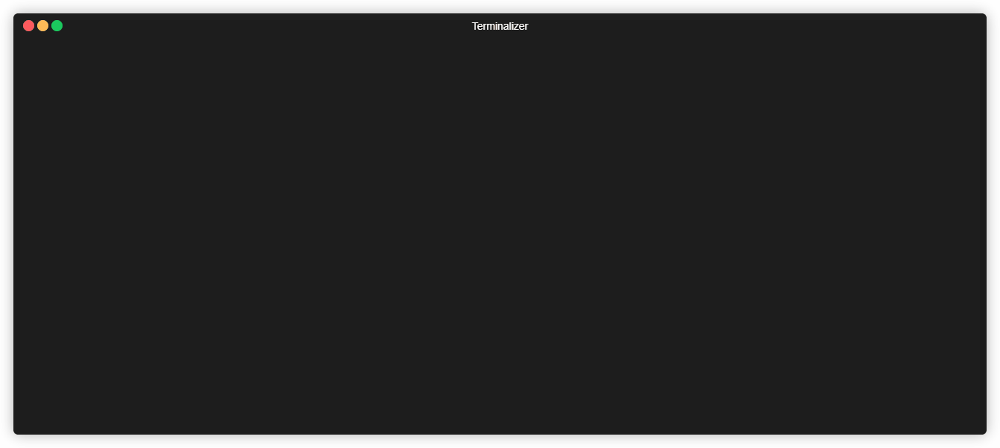

# generator-furkanyilmazx

Generate Rest API template or React component(Functional|Class) with this generator.

## Rest API Template Generate Preview


## React Functional And Class Based Component Template Generate Preview



## Installation

First, install [Yeoman](http://yeoman.io) and generator-furkanyilmazx using [npm](https://www.npmjs.com/) (we assume you have pre-installed [node.js](https://nodejs.org/)).

> Doesn't publish to npm for now

```bash
npm install -g yo
git clone https://github.com/furkanyilmazx/generator-furkanyilmazx
cd ./generator-furkanyilmazx
npm link
```

Generate your new **Rest API** template:

```bash
yo furkanyilmazx
```

Generate your new **React Component(Functional|Class)** template:

```bash
yo furkanyilmazx:react
```

## License

MIT © [furkanyilmazx]()
